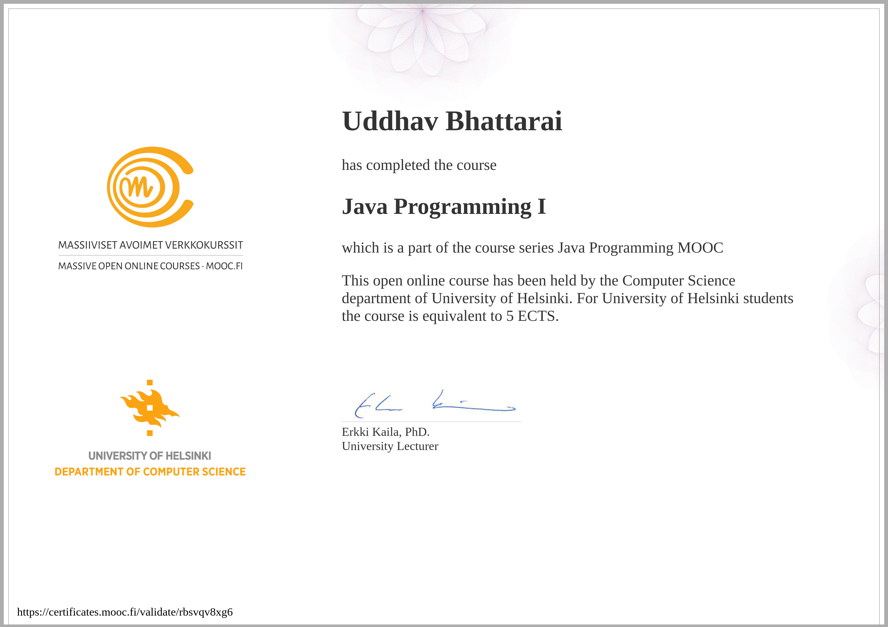

# MOOC Java Programming I



## Overview

This repository contains all exercises, assignments, and projects completed as part of the **MOOC Java Programming I** course offered by the [University of Helsinki](https://www.mooc.fi/en/). The course provides a comprehensive introduction to Java programming, emphasizing foundational concepts, problem-solving, and practical application. All code is written in **Java**, adhering to the course's guidelines for clean, readable, and maintainable code.

This repository serves as a portfolio showcasing my proficiency in core Java programming concepts and my ability to apply them to solve real-world problems. It is organized to reflect the course structure and includes well-documented solutions for each exercise.

## Course Objectives

The **MOOC Java Programming I** course aims to equip learners with the skills to write robust and efficient Java programs. By completing the course, participants are expected to:
- Master the fundamentals of Java programming.
- Apply object-oriented programming (OOP) principles to create modular and reusable code.
- Solve practical problems using control structures, data types, and algorithms.
- Implement effective error and exception handling.
- Build a strong foundation for advanced Java programming topics.


Each `part` directory contains individual exercise files (e.g., `Exercise001.java`) with solutions to the assigned problems. All code includes comments explaining the problem statement, solution approach, and key concepts.

## Key Concepts Covered

The course covers essential Java programming topics, including:

- **Variables, Data Types, and Operators**:
  - Primitive types (`int`, `double`, `boolean`, etc.)
  - String manipulation and concatenation
  - Arithmetic, relational, and logical operators
- **Control Structures**:
  - Conditional statements (`if`, `else`, `switch`)
  - Loops (`while`, `for`, `do-while`)
- **Methods and Parameters**:
  - Method declaration, invocation, and return types
  - Parameter passing and method overloading
- **Arrays and Basic Data Structures**:
  - Working with arrays and `ArrayList`
  - Iteration and manipulation of collections
- **Object-Oriented Programming Basics**:
  - Classes, objects, and constructors
  - Encapsulation and access modifiers (`public`, `private`)
  - Inheritance and polymorphism
- **Exception Handling**:
  - Try-catch blocks for error handling
  - Throwing and catching exceptions
  - Creating custom exception classes

## Learning Outcomes

Through completing this course, I have achieved the following:
- Proficiency in writing clean, efficient, and well-documented Java code.
- Ability to decompose complex problems into manageable components using modular programming.
- Strong understanding of OOP principles and their application in Java.
- Experience in debugging, testing, and validating Java programs.
- Preparation for advanced Java topics and real-world software development.

## How to Use This Repository

1. **Clone the Repository**:
   ```bash
   git clone https://github.com/your-username/mooc-java-programming-i.git
